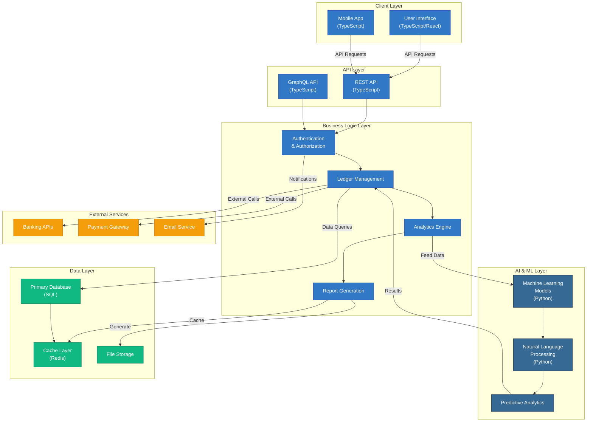

# LedgerPilotAI Architecture Overview

## System Architecture

## Technology Stack

### Frontend (TypeScript - 95.9%)
- **Framework**: React/Next.js
- **State Management**: Redux or Context API
- **UI Components**: Custom components or Material-UI
- **Build Tool**: Webpack/Vite

### Backend (TypeScript - 95.9%)
- **Runtime**: Node.js
- **Framework**: Express.js or NestJS
- **API Design**: REST & GraphQL
- **Authentication**: JWT/OAuth2

### AI/ML (Python - 2.2%)
- **ML Framework**: TensorFlow or PyTorch
- **NLP Libraries**: spaCy or NLTK
- **Data Processing**: Pandas, NumPy
- **Model Serving**: FastAPI or Flask

### Data Layer
- **Database**: PostgreSQL or MongoDB
- **Caching**: Redis
- **File Storage**: S3 or local storage

## Key Features

1. **Ledger Management**: Core functionality for managing financial records
2. **AI-Powered Analytics**: Machine learning models for financial insights
3. **Automated Reporting**: Report generation and export capabilities
4. **Authentication**: Secure user authentication and authorization
5. **External Integrations**: Banking APIs and payment gateway connections

## Data Flow

1. Users interact with the UI/Mobile app
2. Requests flow through REST/GraphQL APIs
3. Authentication layer validates users
4. Business logic processes requests
5. AI/ML models provide predictions and insights
6. Data is persisted in the database
7. Results are cached for performance
8. External services are called when needed

---

*This architecture diagram provides a high-level overview of the LedgerPilotAI system. Refer to specific module documentation for implementation details.*
